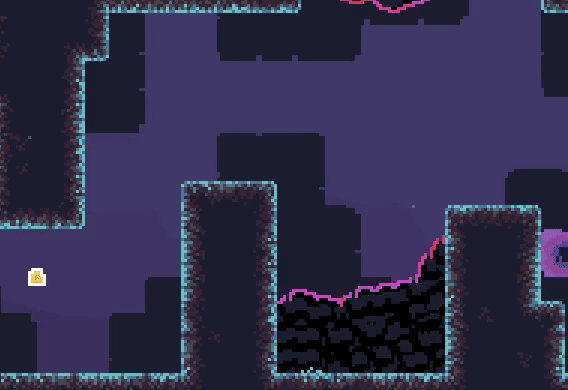
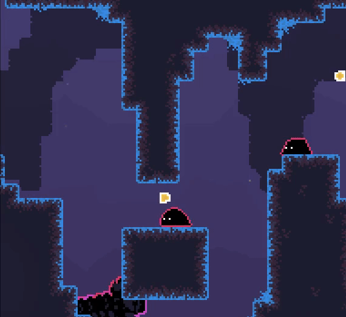

  

# JOYSPRING
A quick platformer about spreading positivity. Our game is still in development, so if you want to help out with designing levels, please check the section below!

### Instructions to Download and Play
1. Head over to the releases page (linked in the right column under About) and expand the Assets dropdown

2. Download the file corresponding to your system

3. Unpack the folder or file and open the executable corresponding to your system (.app, .exe, or .x86_64)

### How to Make Levels
We're hoping for levels that are mostly contained within the screen. Thus, please restrict your level design to somewhere around 40 tiles wide and 23 tiles tall (a bit bigger is fine).
1. Boot up a digital drawing program (ex: MS Paint)

2. Make the canvas size the number of tiles in width and height (ex: 40 x 23)

3. Use each pixel to indicate each type of tile/prop, and use our color legend below. (Don't worry about your level being perfect; we'll adapt your designs if there's an issue, but it'll still be your idea.)    

**White**: empty space   
**Black**: ground or floating platforms (stationary)   
**Blue**: starting position   
**Yellow**: gold droplet   
**Purple**: dangerous blobs (the stationary kind)   
**Red**: dangerous blobs (the moving kind); use the red pixels to outline their path   
**Gray**: moving platforms; use the gray pixels to outline their path   
**Brown**: gravel (note that each of these takes up a 2 x 2 tile area)   
**Green**: prickle blobs (that spring up after player steps on them)   

4. Send the image to studioheartengine@gmail.com
